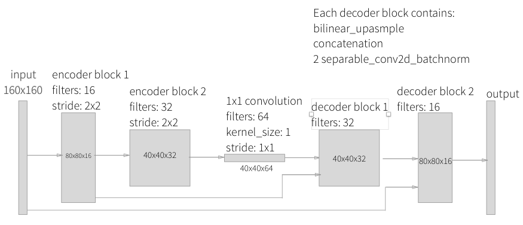

## Segmantic Segmentation ##

Segmantic Segmentation is that task of asisgning meaning to part of an object. With modern deep learning techniques, this can be at the pixel level, where each pixel is assigned to a target class. In this project, I have trained a fully convolutional neural network to identify a target person from images produced by a quadcopter simulator.

### Network Architecture 

A FCN architecture is comprised of an encoder and decoder. 

The encoder portion is a convolutional netwrok that reduces to a 1x1 convolutional layer, in contrast to a flat fully connected layer that would be used for image classfication. This difference has the effect of preserving spatial information from the image. Separable convolutions are used instead of the traditional convolutional layer. This technique reduces the number of parameters needed, thus increasing efficiency for the encoder network. They comprise of a convolution performed over each channel of an input layer and followed by a 1x1 convolution that takes the output channels from the previous step and combines them into an output layer.

In addition to the use of separable convolutions, the encoder layer utilizes batch normalization. Instead of just normalizing the inputs ot the network, batch normalization normalizes the inputs to layers within the network using the mean and variance of the values in the current mini-batch. This technique allows the network to train faster by converging more quickly, allows higher learning rates, and provides a bit of regularization by adding noise to the network. Both separable convolutions and batch normalization are implemented via the separable_conv2d_batchnorm() function in Keras

The decoder portion of the network consists of upsampling layers, traditionally done with transposed convolutions. In this network, I am using bilinear upsampling, a resampling technique that utilizes the weighted average of four nearest known pixels, located diagonally to a given pixel, to estimate a new pixel intensity value. After bilinear upsampling, the upsampled layer is concatenated with a previous layer with more spatial information, providing the same functionality as using skip connections. Finally, a separable convolution layer is added to better learn the spatial details from the previous layers. Together, these 3 steps (bilinear upsampling, concatenation, separable convolution) define 1 "decoder block".


Final network architecture:
 - 2 layers of separable_conv2d_batchnorm with 16 and 32 filters, both with strides of 2. 
 - 1x1 conv2d_batchnorm convolutional layer with 64 filters and a kernel_size and stride of 1
 - 3 decoder blocks, each comprised of a bilinear_upsample layer, layer concatenation, and 2 separable_conv2d_batchnorm layers
 
 
 
Hyperparameters:
 - learning_rate = 0.005
 - batch_size = 64
 - num_epochs = 15
 - steps_per_epoch = 200
 - validation_steps = 50
 - workers = 2
 
Learning rate is a network hyper-parameter that determines how much the model weights are adjusted with respect to the gradient loss. The lower the value, the slower the network will learn. Conversely, a high learning rate might cause the network to fail to converge. 

Batch size defines the number of dataset examples that the network will train on for a forward pass and back propogation. Often, splitting the data into batches is necessary to fit the data into memory. 

An epoch is a single forward and backward pass of the whole dataset. Multiple epochs are used to increase the accuracy of the model without requiring more data.
 
I did not collect any extra data from the simulator, and instead relied on optimizing the network architecture and tuning hyperparamters to improve model performance. The process of arriving at the final network architecture and hyperparameters was brute force trial and error. I started with a netwrok with more layers and a higher learning rate, and noticed the validation loss was much higher than the training loss, indicating that the network was overfitting to the trainig data. I then removed an encoder and decoder block, decreased my learning rate, and increased the number of epochs. These changes significantly increased the weighted IoU score to a satisfactory level.

### Results, limitations and future improvements

The model results yielded a satisfactory weighted IoU score, and can be improved in several ways. The network architecture itself could be improved, and the hyperparamters could be better tuned. To aid in this effort, a technique like GridSearch could be used that automatically test and find the optimal hyperparamters in a given range. The most effective way to improve this model would be to collect and train on more data. Furthermore, this model is only trained on data of huma pedestrians and would not yield good results for segmenting other classes of objects, including cars. To perform well in that task, more data would be needed that inlcudes images and masks of the desired object classes. 


Model performance metrics:
 - number of validation samples intersection over the union evaulated on 542
 - average intersection over union for background is 0.9957319789129099
 - average intersection over union for other people is 0.3463988082570592
 - average intersection over union for the hero is 0.904234709276991
 - number true positives: 539, number false positives: 0, number false negatives: 0
 - number of validation samples intersection over the union evaulated on 270
 - average intersection over union for background is 0.9855268576626636
 - average intersection over union for other people is 0.6774741963135147
 - average intersection over union for the hero is 0.0
 - number true positives: 0, number false positives: 129, number false negatives: 0
 - Final weighted IoU score: 0.415109831473


## Running the project ##

**Download the QuadSim binary**

To interface your neural net with the QuadSim simulator, you must use a version QuadSim that has been custom tailored for this project. The previous version that you might have used for the Controls lab will not work.

The simulator binary can be downloaded [here](https://github.com/udacity/RoboND-DeepLearning/releases/latest)

**Install Dependencies**

You'll need Python 3 and Jupyter Notebooks installed to do this project.  The best way to get setup with these if you are not already is to use Anaconda following along with the [RoboND-Python-Starterkit](https://github.com/udacity/RoboND-Python-StarterKit).

If for some reason you choose not to use Anaconda, you must install the following frameworks and packages on your system:
* Python 3.x
* Tensorflow 1.2.1
* NumPy 1.11
* SciPy 0.17.0
* eventlet 
* Flask
* h5py
* PIL
* python-socketio
* scikit-image
* transforms3d
* PyQt4/Pyqt5


The data directory is organized as follows:
```
data/runs - contains the results of prediction runs
data/train/images - contains images for the training set
data/train/masks - contains masked (labeled) images for the training set
data/validation/images - contains images for the validation set
data/validation/masks - contains masked (labeled) images for the validation set
data/weights - contains trained TensorFlow models

data/raw_sim_data/train/run1
data/raw_sim_data/validation/run1
```


### Image Preprocessing ###
Before the network is trained, the images first need to be undergo a preprocessing step. The preprocessing step transforms the depth masks from the sim, into binary masks suitable for training a neural network. It also converts the images from .png to .jpeg to create a reduced sized dataset, suitable for uploading to AWS. 
To run preprocessing:
```
$ python preprocess_ims.py
```

**Important Note 1:** 

Running `preprocess_ims.py` does *not* delete files in the processed_data folder. This means if you leave images in processed data and collect a new dataset, some of the data in processed_data will be overwritten some will be left as is. It is recommended to **delete** the train and validation folders inside processed_data(or the entire folder) before running `preprocess_ims.py` with a new set of collected data.

**Important Note 2:**

The notebook, and supporting code assume your data for training/validation is in data/train, and data/validation. After you run `preprocess_ims.py` you will have new `train`, and possibly `validation` folders in the `processed_ims`.
Rename or move `data/train`, and `data/validation`, then move `data/processed_ims/train`, into `data/`, and  `data/processed_ims/validation`also into `data/`

**Important Note 3:**

Merging multiple `train` or `validation` may be difficult, it is recommended that data choices be determined by what you include in `raw_sim_data/train/run1` with possibly many different runs in the directory. You can create a temporary folder in `data/` and store raw run data you don't currently want to use, but that may be useful for later. Choose which `run_x` folders to include in `raw_sim_data/train`, and `raw_sim_data/validation`, then run  `preprocess_ims.py` from within the 'code/' directory to generate your new training and validation sets. 
